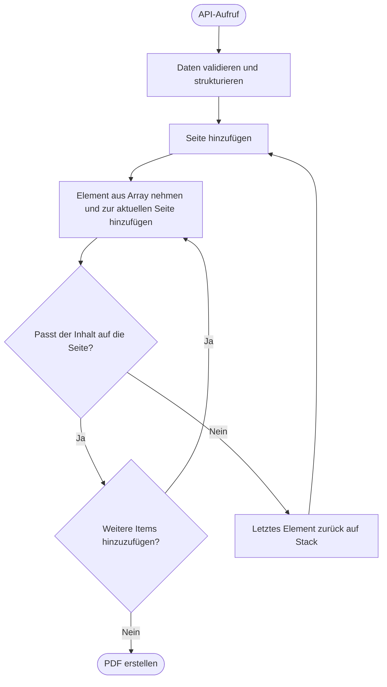

# PDF-Generierung neu gedacht: Weg von starren PDF-Dokumenten

Als Entwickler, der mit responsiven Webseiten aufgewachsen ist, bringt PDF-Generierung einen echten Paradigmenwechsel mit sich. Wir denken in unendlichem Scrollen, flexiblen Containern und Inhalten, die sich an jede Bildschirmgröße anpassen.

Bei PDFs ist alles anders: feste Seitendimensionen, manuelle Positionierung, Inhalte müssen in starre Grenzen passen. Das Gemeine dabei: Oft wissen wir erst zur Laufzeit, wie viel Inhalt überhaupt da ist. Wird das Dokument eine Seite oder zehn?

Doch es gibt eine Methode, diese beiden Welten zu verbinden: flexible Webentwicklung trifft feste PDF-Grenzen.

**Kurz zusammengefasst:**

- **Problem**: CSS Print Media versagt bei variablen Inhaltslängen (mal 3, mal 300 Einträge)
- **Lösung**: Browser rendern lassen, dann das Ergebnis messen - statt vorher alles zu berechnen
- **Technik**: Puppeteer + beliebiges Framework (React/Vue/Svelte) - funktioniert überall
- **Performance**: 3-4 Sekunden für 6-seitige PDFs mit hunderten Datenpunkten
- **Passt für**: Komplexe, datengetriebene Dokumente mit unvorhersagbaren Längen

[Direkt zur Herausforderung](#section-die-herausforderung-komplexität-aus-der-praxis) oder [zur Lösung](#section-die-lösung-browser-basierte-messung).

## Die Geschichte: Von persönlicher Frustration zur echten Herausforderung

Lebensläufe in verschiedenen Sprachen aktualisieren - das nervt seit Jahren. Besonders, weil die gleichen Informationen auch auf der Website gepflegt werden und jedes Jahr kommt eine neue Plattform dazu, auf der wieder alles eingegeben werden muss.

Die Website ist die Hauptquelle, aber Recruiter und Unternehmen wollen trotzdem ein PDF. Also lag die Idee nahe: Warum nicht einfach die Projektübersicht als PDF ausgeben? Kann ja nicht so schwer sein, oder?

Falsch gedacht. `@pages`, `page-break-before` - vieles wurde versucht. Das Ergebnis war jedes Mal grottig. Die Website ist responsiv, aber fürs Drucken überhaupt nicht gedacht.

Also wurden neue Ansätze erdacht, komplett von vorne angefangen und nach Tools gesucht. Unzählige PDF-Bibliotheken durchforstet, aber nie das gefunden, was wirklich passte: ein flexibles System, dem man einfach Elemente hinzufügen kann. So wie bei einer Webseite - Elemente hinzufügen und sie fließen automatisch von Seite zu Seite.

Alle Ansätze wirkten komplex und die Angst, sich zu verzetteln, war groß. Dann kam ein neuer Kunde - und der wollte genau das. Die Nervosität wegen der unausgegorenen Ideen war da, aber es stand schon ewig auf der Todo-Liste. Also wurde es gewagt - und es wurde eine richtig spannende Herausforderung, die definitiv machbar war.

## Die Herausforderung: Komplexität aus der Praxis

Der Auftrag kam zur perfekten Zeit. Der Kunde brauchte automatisierte PDF-Generierung für Kommissionierlisten im Lager - **hunderte täglich**. Der Inhalt variierte von 3 bis **über 100 Artikeln**, mit standortbasierter Gruppierung und null Toleranz für hässliche oder langsame Ausgaben.

Die Anforderungen machten CSS Print Media komplett zunichte:

- **Unbekannte Inhaltslänge** mit extremen Schwankungen bei den Artikelzahlen
- **Standortbasierte Gruppierung**, bei der Überschriften bei ihrem Inhalt bleiben mussten
- **Wiederholende Tabellenköpfe** über mehrere Seiten (CSS `thead` Wiederholung ist unzuverlässig)
- **Unterschiedliche Layouts** - vollständiger Header auf Seite 1, kompakter Header auf Folgeseiten
- **Produktionsgeschwindigkeit** - musste auch bei echter Lagerlast schnell generieren

Traditionelle Print-Ansätze waren völlig ungeeignet. Jedes PDF wäre strukturell anders und jede langsame oder unzuverlässige Lösung hätte die täglichen Abläufe gesprengt.

Aber das Timing war perfekt - ich hatte monatelang daran gedacht und jetzt drückte ein echter Kunde aufs Tempo.

## Die Lösung: Browser-basierte Messung

Die Idee ist einfach: messen statt berechnen. Anstatt Schrifthöhen zu berechnen und Zeilenumbrüche zu raten, den Browser machen lassen, was er am besten kann - Content rendern - und dann das Ergebnis messen.

Die erste Version setzte noch auf starre Vorab-Berechnungen. Das Problem war nicht die Berechnung, sondern die Architektur drumherum. Man braucht eine zentrale Definition aller CSS-Eigenschaften und muss sie sowohl an die Backend-Logik als auch an die Frontend-Komponenten weiterreichen. Layout-Berechnung und Styling werden dadurch viel zu eng gekoppelt.

Richtig schmerzhaft wird es bei CSS-Änderungen. Einen Margin hinzufügen ist nicht mehr nur eine CSS-Klasse - die Änderung muss in beiden Systemen koordiniert werden. Einfache Design-Entscheidungen werden zu Architektur-Problemen.

Bei komplexen Dokumenten wird das völlig unhandhabbar. Jede kleine CSS-Anpassung bedeutet, die Berechnungslogik zu verstehen und anzupassen.

Der browser-basierte Ansatz räumt damit komplett auf. Der Browser rechnet alles selbst - Abstände, Schriften, Zeilenumbrüche - und stellt die Messergebnisse zur Verfügung. Margin hinzufügen? Einfach CSS-Klasse setzen. Das Messsystem passt sich automatisch an.

## Die Architektur

**SvelteKit** übernimmt in der Implementierung die Dokumentstruktur, aber der Ansatz funktioniert mit jedem Framework - **React**, **Vue** oder auch komplett ohne Framework. Die Messlogik ist framework-unabhängig, wobei schnellere Frameworks auch schnellere PDF-Generierung bedeuten, da alles auf echtem DOM-Rendering basiert.

Komponenten machen die Entwicklung einfacher und entsprechen modernen Standards, sind aber nicht zwingend nötig.

**Puppeteer** erstellt die PDFs über Chrome's Print Engine. Das ist entscheidend: Puppeteer macht keine Screenshots, sondern echte PDFs mit auswählbarem Text, sauberen Schriften und professioneller Qualität - PDFs, die man durchsuchen, archivieren und sauber drucken kann.

Die API ist überschaubar:

```javascript
import puppeteer from "puppeteer";

// Browser starten und PDF generieren
const browser = await puppeteer.launch();
const page = await browser.newPage();

await page.goto(documentURL, {
  waitUntil: "networkidle0",
});

const pdf = await page.pdf({
  format: "A4",
  margin: { bottom: 0, top: 0, right: 0, left: 0 },
  preferCSSPageSize: true,
});

await browser.close();
```

## So funktioniert die Messung

Jede Seite ist erstmal nur ein Rahmen für verschiedene Elemente. Manche sind fest (Header, Footer), andere sind Inhaltsbereiche, die sich über mehrere Seiten erstrecken können. Wenn ein Inhaltsbereich merkt, dass neue Elemente nicht mehr passen, erstellt er automatisch eine neue Seite. Der Trick: Browser rendern lassen, dann messen.



Der Ablauf ist simpel: Elemente einzeln hinzufügen, dann prüfen ob alles passt. Falls nicht: letztes Element entfernen und neue Seite beginnen. Der Browser macht die ganze komplexe Arbeit - Textumbruch, Abstände, Spacing - ich messe nur das Endergebnis.

Das funktioniert mit jedem Content-Typ, weil man nicht versucht, Layout-Verhalten vorherzusagen. Ob komplexe Tabelle, mehrzeiliger Text oder gemischter Inhalt - der Browser rendert korrekt und sagt genau, wie viel Platz gebraucht wird.

Alle Inhalte werden vorher in vollständige Elemente aufgeteilt. Bei den Kommissionierlisten wird jede Tabellenzeile zu einem separaten Array-Element. Tabellen werden umstrukturiert und gruppiert, Text formatiert - alles wird zu kompletten Einheiten, die entweder passen oder komplett zur nächsten Seite wandern. Kein Element muss während des Layouts geteilt werden.

Die Performance stimmt: 3-4 Sekunden für ein 6-seitiges PDF mit hunderten Datenpunkten. Nicht blitzschnell, aber völlig in Ordnung für Produktivumgebungen mit einem laufenden Prozess.

## Das Problem mit klassischen PDF-Bibliotheken

Klassische PDF-Bibliotheken wie jsPDF und PDFKit arbeiten mit absoluter Positionierung - jedes Element braucht exakte x- und y-Koordinaten. Bei variablen Inhalten heißt das: manuelle Berechnungen. Wie hoch wird dieser Textblock? Wo kommt das nächste Element hin? Was passiert bei 3 statt 30 Tabellenzeilen?

Dazu kommt: man ist auf primitives Styling beschränkt. Ich wollte aber modernes CSS - Flexbox, Grid, alle Browser-Features - und komponentenbasierte Entwicklung.

Mein Ansatz dreht beide Probleme um: Browser übernimmt Layout und Styling, ich messe das Ergebnis. Ob 3 oder 300 Lager-Artikel - der Browser rendert normal und ich prüfe nur "passt das noch?"

## Von Frustration zur Produktion

Was als Lebenslauf-Frustration anfing, ist heute ein Produktionssystem, das täglich hunderte Kommissionierlisten generiert. Die PDFs laufen nahtlos durch die Druck-Pipeline des Kunden und das Lagerpersonal bekommt professionelle Dokumente, mit denen sie arbeiten können.


**Wann sich der Ansatz lohnt:**

Browser-basierte Messung glänzt bei:

- **Variablen Inhaltslängen** - Dokumente, die je nach Daten 1 oder 10 Seiten haben
- **Komplexen Layouts** - Tabellen, Header, gemischte Inhalte mit richtigem Styling
- **Modernen Entwicklungsmustern** - du willst Komponenten und aktuelle Webstandards nutzen
- **Vollständiger CSS-Kontrolle** - Flexbox, Grid, Custom Properties, responsive Ansätze

**Wann etwas anderes besser ist:**

Bei simplen Textdokumenten mit wenig CSS bringt der Ansatz unnötige Komplexität. Normales Web-Printing oder einfachere PDF-Tools reichen, wenn keine dynamischen Seitenumbrüche oder komplexe Layouts gebraucht werden.

Der Sweet Spot sind datengetriebene Dokumente mit unvorhersagbaren Längen und anspruchsvollem CSS - genau dort, wo klassische PDF-Bibliotheken schwächeln.

**Unterm Strich:**

Der Ansatz eliminiert die manuelle Positionierung und Layout-Rechnerei, die bei klassischen PDF-Bibliotheken und variablen Inhalten so schmerzhaft ist. Keine Texthöhen-Prophezeiungen oder Overflow-Management mehr.

**Hilfe bei komplexer PDF-Generierung gesucht?** Solche Herausforderungen wurden bereits für Produktionssysteme gelöst und die typischen Fallen lassen sich umgehen. Ob variable Dokumente, komplexe Layouts oder Migration von bestehenden PDF-Tools - ein Gespräch über konkrete Anforderungen kann den entscheidenden Unterschied machen.
