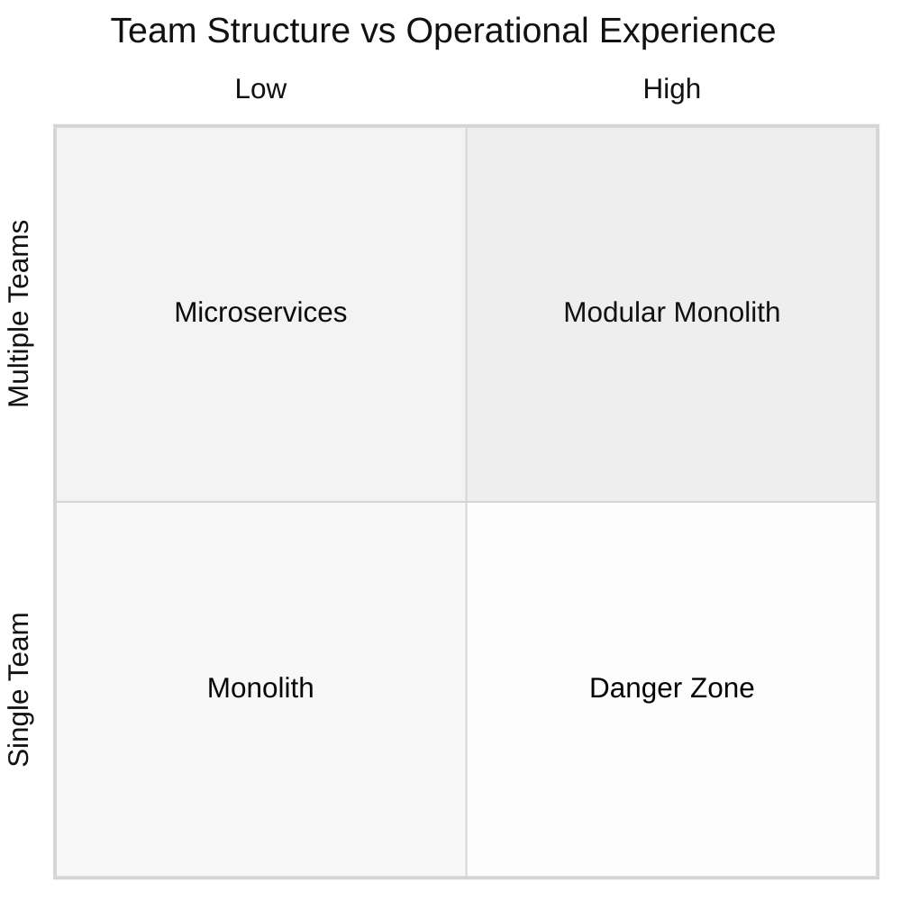

# Zwischen Monolith und Microservices: Praktische Software-Architektur-Patterns für moderne Anwendungen

Die meisten Artikel zu dem Thema Microservice und Monolith suggerieren, dass es nur schwarz oder weiß gibt, aber in Wahrheit existiert ein ganzes Universum zwischen diesen Extremen.

Dabei wird oft übersehen, dass es viele Faktoren gibt, die berücksichtigt werden sollten. Besonders wird oft vernachlässigt, dass diese sich auch ändern können, diese aber Einfluss auf die Arbeitsweise und damit auf die beste Architektur haben.

In diesem Prozess kann eine Bewegung hin zum Monolithen oder zu Microservices erfolgen. Dieser Wandel erfolgt dabei meist schrittweise und nicht in einer großen Hauruckaktion.

## Monolith vs Microservices: Definition und Unterschiede

Um ein klareres Bild zu schaffen und eine Diskussionsgrundlage zu schaffen, ist es wichtig Monolith und Microservice genau zu definieren. Gerade bei Microservice ist oft ein großer Unterschied in der Definition und Größe vorhanden.

**Monolith**: Mehrere Prozesse und Funktionen vereint in einer Codebasis, ermöglicht ein einfacheres Deployment und Wiederverwenden von Hilfsfunktionen.

**Microservice**: Kann in ca. zwei Tagen komplett neu geschrieben werden, besitzt eigene Daten, kann unabhängig deployed werden und konzentriert sich auf einen logischen Aspekt. Klar durch API-Schnittstelle von anderen Services getrennt.

## Software-Architektur-Entscheidung: Zwischen Monolith und Microservices

Meist wird die Architektur einer Software zu Beginn festgelegt. Dabei wird meist vergessen, dass sich die äußeren Umstände (Teamgröße, Funktionsumfang, Anforderungen) ändern können. Das führt oft dazu, dass die Architektur nicht mehr so funktioniert wie angedacht. Anstatt in starren Grenzen zu denken, sollte man einen gewissen Wandel in der Architektur schon mitdenken und einplannen. **Die Architektur passt sich dem Team an und nicht umgekehrt.**

Langfristig spart man sich dadurch Frust und unnötigen Overhead der das Projekt enorm verlangsamen kann.

### Beide Extreme haben Vor- und Nachteile

Jede Architektur hat auch ihre Schattenseiten, wenn sie nicht zur Arbeitsweise passt:

Besonders mit mehreren Teams schaffen **Monolithe** Koordinationsengpässe. Der Fehler eines einzelnen Teams wirkt sich auf die Arbeitsweise und den Zeitplan aller Teams aus. Gerade in solchen Momenten erhöht dies den Kommunikationsaufwand zwischen den Teams enorm. Ein etwas kleinerer Nachteil, aber dennoch nicht zu unterschätzen sind die Skalierungsmöglichkeiten. Für jeden Service der mehr Ressourcen benötigt muss immer der ganze Monolithen neu deployed werden, statt der einzelnen kleineren Teile.

Ein Netzwerk von **Microservices** aufzubauen, erzeugt hingegen einen nicht zu unterschätzenden operationellen Overhead, der einfache Prozesse oder Implementierungen verkompliziert. Dabei ist das komplexere Monitoring noch gar nicht mit eingepreist. Bei ausreichend personellen Kapazitäten ist dies meist kein Problem, bei kleinen Teams und geringem Budget kann dies aber zum Problem werden.

### Den Sweet Spot finden

Bei Problemen mit einer der Architekturen (Monolith, Microservice) besteht die Lösung oft nicht darin einfach auf das andere System zu springen, sondern den Sweet Spot dazwischen zu finden, der zur jeweiligen Struktur und Kultur passt. Das kann verschiedene Ansätze bedeuten:

- Mehrere Monolithe (jedes Team hat seinen eigenen)
- Mehrere Services (die weder wirklich micro noch Monolith sind)
- Verschiedene Teams nutzen verschiedene Ansätze - einige mit Microservices, einige mit Services, einige mit eigenen Monolithen

Die Welt ist eben nicht nur schwarz-weiß.

Nicht empfehlenswert ist es, einen Monolithen über verschiedene Teams hinweg zu betreiben, obwohl auch das möglich ist - es erfordert jedoch extensive Kommunikation zwischen den Teams, was unnötigen Aufwand bedeutet und die Teams wieder etwas verschmilzt. Das Problem: Je mehr Personen beteiligt sind, desto komplexer wird die Kommunikation. Ein informeller und auch planerischer Austausch über Teamgrenzen hinweg bleibt wichtig, sollte sich aber auf strukturelle Probleme konzentrieren und nicht auf Implementierungsdetails.

Die entscheidende Erkenntnis: Welche Probleme stärker schmerzen, hängt vollständig von der Teamstruktur und operationellen Erfahrung ab.

### Wann Microservices? Entscheidungsmatrix für Entwicklungsteams

**Unten Links (Einzelnes Team, niedrige Ops-Erfahrung)**: Hier bietet sich der klassische Monolith an. Die Koordination funktioniert natürlich durch direkte Kommunikation, operationelle Komplexität wird vermieden.

**Oben Rechts (Mehrere Teams, hohe Ops-Erfahrung)**: In dieser Situation werden Microservices praktisch unumgänglich. Klare Abgrenzungen sind erforderlich, um das Koordinationschaos zu vermeiden, gleichzeitig ist die nötige Expertise vorhanden, um mit verteilter Komplexität umzugehen.

**Unten Rechts (Einzelnes Team, hohe Ops-Erfahrung)**: Das ist der Bereich, wo gemischte Modelle ihre Stärken ausspielen können. Modulare Monolithe oder service-orientierte Ansätze bieten architektonische Vorteile, ohne operationellen Overhead zu erzeugen.

**Oben Links (Mehrere Teams, niedrige Ops-Erfahrung)**: Die Gefahrenzone. Hier springen Teams oft reflexartig zu Microservices, um Koordinationsprobleme zu lösen, haben aber nicht die operationelle Reife, um sie erfolgreich zu betreiben.

### Ein einfaches Beispiel

Ein Startup mit 3 Entwicklern und einem E-Commerce-System startet mit einem Monolithen. Nach 18 Monaten: 6 Entwickler in 2 Teams, PDF-Generierung für Rechnungen blockiert regelmäßig das Checkout-System. Lösung: PDF-Generator als Satellit extrahiert. Die Kern-Geschäftslogik bleibt im Monolithen, aber der Performance-Engpass ist gelöst und Team 1 und 2 müssen nicht an der gleichen Code Basis arbeiten. Weitere Services können ausgelagert werden.

## Modularer Monolith: Software-Architektur für wachsende Teams

Teamstrukturen ändern sich mit der Zeit. Ein Team wird zu zwei, besonders bei wachsenden Produkten. Der Monolith muss für diese Evolution gerüstet sein.

### Natürliche Grenzen erkennen

Die Datenbankstruktur zeigt oft auf, wo sinnvoll aufgeteilt werden kann. Zum Beispiel sind Product und Order zwar verwandt, leben aber in separaten Tabellen - das ist auch ein natürlicher Ort für eine spätere Service-Trennung. Ein zukünftiger Service benötigt nicht nur eine Tabelle, sollte aber eine klar abgegrenzte Domäne besitzen.

### Für Extraktion entwickeln

Diese Domänen sollten innerhalb der Codebasis durch geschichtete Architektur und saubere Domänengrenzen getrennt werden. Jede Domäne stellt ein sauberes Interface zur Verfügung, das genau definiert, welche Funktionen von anderen Teilen aufgerufen werden können. Das sind keine komplexen Tools - es ist Entwicklungsdisziplin.

Der Gewinn ist beträchtlich. Diese Interfaces werden zu APIs, wenn Services extrahiert werden. Die Wrapper-Funktionen schützen den Rest des Systems während Änderungen. Domänen können intern umstrukturiert werden, ohne andere Bereiche zu beeinträchtigen.

Klare Struktur ist in Monolithen wichtiger als überall sonst. Der minimale Aufwand im Vorfeld spart später wochenlange Extraktionsarbeit bei nahezu keinen zusätzlichen Kosten.

## Satellite Services Architecture: Monolith mit Satelliten-Services

Stellt man sich den Monolith als Erde vor – einen zentralen Ort, wo das "Leben" (die Geschäftslogik) stattfindet. Um ihn schwirren spezialisierte Satelliten-Services, die spezifische Aufgaben übernehmen, die auf der "Erde" theoretisch möglich wären, aber als eigenständige Satelliten viel praktischer sind. Dadurch werden komplexe technische Aufgaben separiert und der Hauptmonolith bleibt übersichtlich. Dennoch bleibt die zentrale Geschäftslogik sauber auf der Erde, während spezialisierte Services als Satelliten ihre Unterstützung leisten.

### Warum Satelliten funktionieren

Satelliten-Services benötigen nicht die Struktur der Hauptsoftware. Sie können optimal an ihre spezifischen Bedürfnisse angepasst werden - ein PDF-Generator braucht keine Benutzerauthentifizierung oder komplexe Geschäftsregeln. Ein Bildprozessor kann vollständig andere, für seine Aufgabe optimierte Technologien verwenden.

Diese Services sind oft so allgemein gehalten, dass sie problemlos in anderen Projekten wiederverwendet werden können. Der Bildformatierungs-Service funktioniert genauso gut für die mobile App wie für die Web-Plattform.

Einige Satelliten benötigen massive Rechenpower und können auf separaten Instanzen deployed werden, ohne den Overhead des gesamten Monolithen. Die PDF-Generierung lässt sich unabhängig skalieren, während der Kernmonolith leichtgewichtig bleibt.

### Ideale Satelliten

Die besten Kandidaten für Satelliten-Services sind:

- Bild-/Videobearbeitung
- [PDF-Generierung](https://dropanote.de/en/blog/20250805-dynamic-pdf-generation-puppeteer/)
- E-Mail-Versand
- Schwere Berechnungen
- Dateikonvertierungen
- Externe Integrationen

Sie haben einfache Schnittstellen, klare Verantwortlichkeiten und andere Ressourcenbedürfnisse als die Kern-Geschäftslogik.

### Wann Satellite Services Architecture sinnvoll ist

Dieses Pattern eignet sich, wenn klare Utility-Funktionen vorhanden sind, die nicht zur Kern-Geschäftslogik gehören. Wenn PDF-Generierung die Bestellabwicklung verlangsamt oder Bildgrößenänderungen die Server-Ressourcen aufbrauchen, sind das perfekte Satelliten-Kandidaten.

Es macht auch Sinn beim Aufbau neuer Teams. Einige Teams können sich auf Satelliten konzentrieren, während andere die Hauptsoftware betreuen. Oder bei der Zusammenarbeit mit externen Freelancern - sie können Satelliten wie SaaS handhaben, während das interne Team sie konsumiert.

### Der Evolutionspfad

Teams starten normalerweise mit einem Monolithen und extrahieren schrittweise Satelliten. Zunächst werden Performance-Engpässe oder übermäßig komplexe Verarbeitungen identifiziert. PDF-Generierung, die 30 Sekunden dauert, wird zu einem offensichtlichen Satelliten-Kandidaten.

Die Evolution wird oft von Skalierungsanforderungen getrieben. Wenn die Bildverarbeitung andere Hardware als der Webserver benötigt, wird Extraktion unumgänglich. Anders als bei vollständigen Microservices können Satelliten nacheinander extrahiert werden, ohne das gesamte System zu stören.

## Microservices Fallstricke: Häufige Architektur-Fehler vermeiden

Immer wieder lassen sich Teams von denselben Fehlern bei der Implementierung dieser Patterns überraschen. Die meisten scheinen im Nachhinein offensichtlich, sind aber überraschend leicht zu begehen.

### Technische Fallstricke

**Geteilte Datenbanken**: Teams erstellen separate Services, greifen aber weiterhin auf dieselben Datenbanktabellen zu. Es wirkt wie eine Trennung, aber tatsächlich wurde nichts entkoppelt. Die Services können immer noch nicht unabhängig entwickelt werden, da sie um dieselbe Datenstruktur konkurrieren.

**Falsche Abgrenzungen**: Aufteilung nach technischen Schichten statt nach Geschäftsdomänen. Das Ergebnis sind Frontend-, Backend- und Datenbank-Services - die alle zusammen für jedes Feature geändert werden müssen. Das löst das Koordinationsproblem nicht wirklich.

**Verteilter Monolith**: Services, die nicht ohne einander funktionieren können. Wenn der Bestellservice bei jedem Ausfall des Benutzerservices bricht, wurde lediglich das Deployment erschwert, ohne Unabhängigkeit zu gewinnen.

### Organisatorische Fallstricke

**Unklare Verantwortlichkeiten**: Niemand ist für die Grenzen verantwortlich. Code beginnt über Domänen hinweg zu "bluten", weil es keine klare Zuständigkeit gibt. "Benutzerverwaltungs"-Logik findet sich über fünf verschiedene Services verteilt, weil sich kein Team für die Pflege sauberer Schnittstellen verantwortlich fühlte.

**Vorzeitige Extraktion**: Services werden extrahiert, bevor verstanden wird, was zusammengehört. PDF-Generierung wird als Service herausgezogen, dann stellt sich heraus, dass sie tiefe Integration mit den Geschäftsregeln benötigt. Plötzlich werden Netzwerk-Aufrufe für das gemacht, was früher Funktionsaufrufe waren.

### Prozess-Fallstricke

**Big-Bang-Migrationen**: Der Versuch, alles auf einmal umzustrukturieren. Teams werden von der neuen Architektur begeistert und möchten gleichzeitig fünf Services extrahieren. Es dauert immer dreimal länger als erwartet.

**Schleichende operationelle Komplexität**: Einfach anfangen, aber schrittweise Komplexität hinzufügen, ohne es zu bemerken. Erst werden Deployment-Pipelines benötigt, dann Monitoring, dann Service Discovery. Plötzlich braucht der "einfache" Satelliten-Service mehr Infrastruktur als der ursprüngliche Monolith.

## Fazit

Bei der Betrachtung aller Architektur-Entscheidungen zeigt sich: Die erfolgreichsten Systeme waren nicht die, die Lehrbuch-Patterns perfekt befolgten. Es waren die, die ihre eigene Balance zwischen konkurrierenden Kräften fanden.

Die Grauzone zwischen Monolith und Microservices ist kein Kompromiss - sie ist oft die optimale Lösung. Modulare Monolithe, die zu Services entwickelt werden können. Satellite Services Architecture, die Komplexität trennen und dabei Einfachheit bewahren. Gemischte Ansätze je nach tatsächlichen Gegebenheiten der Teams.

Architektur spiegelt die Realität der Organisation wider, ob geplant oder nicht. Teams wachsen, Produkte skalieren, operationelle Reife entwickelt sich. Die Architekturen, die überdauern, sind darauf ausgelegt, mit diesen Änderungen zu wachsen, nicht gegen sie zu kämpfen.

Die Welt ist nicht schwarz-weiß, und die Architektur sollte es auch nicht sein.
