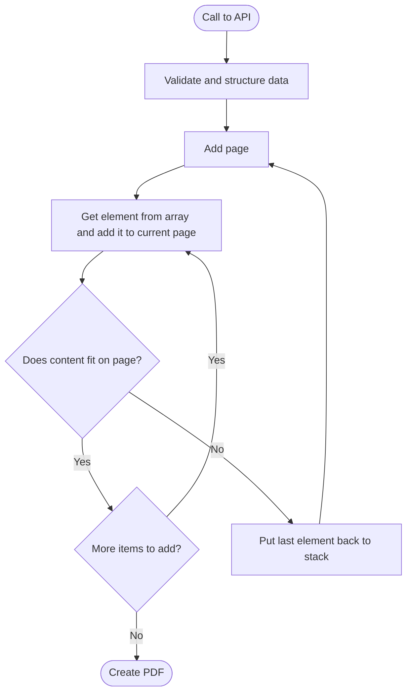

# Professional PDF Document Generation with HTML/CSS: Variable Content Without Absolute Positioning

Modern interface design and generating PDFs with common tools like jsPDF and PDFKit feels like two different worlds. Having to set every position manually is a design nightmare, especially for simple changes like adding more space between elements.

The challenge gets worse when content length varies: How many pages do I need for 300 items versus 30?

On web pages, this isn't a problem - the browser handles rendering and positioning elegantly. So why not use the full power of HTML and CSS to generate PDFs in a nice and easy way?

**TL;DR:**

- **Problem**: CSS print media fails for variable content lengths (3 items vs 300 items)
- **Solution**: Let the browser render content, then measure actual results instead of calculating positions
- **Tech**: Puppeteer + any framework (React/Vue/Svelte) - framework-agnostic approach
- **Performance**: 3-4 seconds for 6-page PDFs with hundreds of data points
- **Best for**: Complex, data-driven documents with unpredictable lengths

## PDF Generation Example: Warehouse Pick Lists with Variable Content

A customer requested me to create automated PDF generation for warehouse pick lists with **hundreds generated daily** - variable content from 3 to **100+ items**, location-based grouping, and zero tolerance for ugly output or slow generation.

The requirements killed any hope of using CSS print styles:

- **Unknown content length** with wildly varying item counts
- **Location-based grouping** where headers needed to stay with their content
- **Repeating table headers** across pages (CSS `thead` repetition is unreliable)
- **Different layouts** - full header on page 1, minimal headers on subsequent pages
- **Production speed** - had to generate quickly under real warehouse load

Traditional "design for print" approaches were completely inadequate. Every PDF would be structurally different, and any solution that was slow or unreliable would break their daily operations.

But the timing was perfect - I had months of mental groundwork done, and now I had a real customer need pushing me to finally solve it.

## HTML to PDF: Let the Browser Calculate Layout Instead of Manual Positioning

The breakthrough came from a simple realization: stop trying to predict layout and start measuring actual results. Instead of calculating font heights and estimating line breaks, let the browser do what it does best - render content - then measure what actually happened.

My first version used the styling information - font heights, padding, margins - as inputs to calculate the total content height. The problem wasn't the calculation itself, but the architecture it required. You need one central definition of all styling values, then pass them correctly to both the backend calculation logic and the frontend components. This creates a tight coupling between your layout calculations and your styling.

The real pain comes when you want to make styling changes. Adding a margin isn't just adding a CSS class anymore - it becomes complex because you have to coordinate the change across both the calculation system and the rendering system. Simple styling decisions become architectural decisions.

With complex document structures, this becomes unmanageable. Every styling tweak requires understanding and updating the calculation logic.

The browser-based approach eliminates this entirely. The browser handles all styling calculations internally - margins, padding, font rendering, line breaks - and I just measure the final rendered result. Want to add a margin? Just add the CSS class. The measurement system automatically adapts to whatever the browser renders.

## Tech Stack: Puppeteer PDF Generation with Any Framework

**SvelteKit** handles the document structure in my implementation, but this approach works with any framework - **React**, **Vue**, or even plain HTML. The core measurement logic is framework-agnostic, though faster-rendering frameworks will generate PDFs quicker since the approach relies on actual DOM rendering.

Components make development easier and follow modern patterns, but they're not required.

**Puppeteer** generates the actual PDFs using Chrome's print engine. This is crucial: Puppeteer doesn't just take screenshots. The resulting PDFs have selectable text, proper fonts, and professional document quality - real PDFs that can be searched, archived, and printed cleanly.

The API is simple:

```javascript
import puppeteer from "puppeteer";

// Launch browser and generate PDF
const browser = await puppeteer.launch();
const page = await browser.newPage();

await page.goto(documentURL, {
  waitUntil: "networkidle0",
});

const pdf = await page.pdf({
  format: "A4",
  margin: { bottom: 0, top: 0, right: 0, left: 0 },
  preferCSSPageSize: true,
});

await browser.close();
```

## PDF Page Layout Process: Add Elements Until They Don't Fit

Every page starts as a frame where you add different elements. Some are fixed (headers, footers), others are content areas that can span multiple pages. When a content area detects that new items won't fit, it triggers the creation of a new page. The key insight: let the browser render everything first, then measure the results.



The process is simple: add elements one by one to the content area, then check if everything still fits. If not, remove the last item and start a new page. The browser handles all the complex layout calculations - text wrapping, margins, spacing - and you just measure the final result.

This approach works with any content type because you're not trying to predict layout behavior. Whether it's a complex table, multiline text, or mixed content, the browser renders it correctly and tells you exactly how much space it takes.

All content gets preprocessed into complete elements before rendering. For the pick lists, each table row becomes a separate element in the array. Tables get restructured and grouped, text gets formatted - everything becomes complete units that either fit on a page or move to the next page as a whole. No element needs splitting logic during page layout.

Performance is solid: 3-4 seconds for a 6-page PDF with hundreds of data points. Not lightning fast, but completely acceptable for production use with only one process running.

## Why Traditional PDF Libraries Fail for Variable Content

Traditional PDF libraries like jsPDF and PDFKit use absolute positioning - every element needs exact x and y coordinates. For variable content lengths, this means manual calculations: How tall is this text block? Where should the next element go? What if this table has 3 rows versus 30?

Plus, you're stuck with basic styling. I wanted full CSS support - flexbox, grid, modern browser features - and component-based development patterns.

My approach flips both problems: let the browser handle layout and styling naturally, then measure the results. Whether it's 3 warehouse items or 300, the browser renders normally and I just check "does this fit?"

## When to Use Browser-Based PDF Generation vs. Other Alternatives

What started as my frustration with printing my CV has become a production system generating hundreds of warehouse pick lists daily. The PDFs integrate seamlessly into the customer's printing pipeline, and warehouse staff get professional documents they can actually use.


**When This Approach Makes Sense:**

This browser-based measurement approach shines when you have:

- **Variable content lengths** - documents that could be 1 page or 10 pages depending on data
- **Complex layouts** - tables, headers, mixed content that needs proper styling
- **Component-based thinking** - you want to use modern web development patterns
- **Full CSS control** - flexbox, grid, custom properties, responsive design principles

**When to Use Something Else:**

For simple text documents with minimal styling, this approach adds unnecessary complexity. Basic web printing or simpler PDF tools will work fine when you don't need dynamic page breaks or complex layouts.

The sweet spot is data-driven documents with unpredictable content lengths and complex styling requirements - exactly what traditional PDF libraries struggle with.

**The Bottom Line:**

This approach eliminates the manual positioning and layout calculations that make traditional PDF libraries painful for variable content. No more predicting text heights or managing overflow scenarios.

**Need help with complex PDF generation?** I've solved these challenges for production systems and can help you avoid the common pitfalls. Whether it's variable-length documents, complex layouts, or migration from existing PDF tools - let's talk about your specific requirements.
