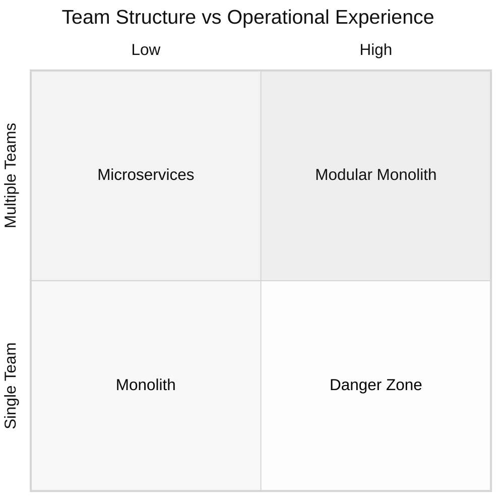

# Between Monolith and Microservices: Practical Architecture Patterns for Development Teams

Every architecture article tells you the same thing: build a monolith or build microservices. But the world isn't black and white - there's a lot of gray between.

Nobody tells you that there are a lot of factors you should keep in mind and that with growing there will be also changes in this structure. In the real world we do small steps and not just jumping from monolith to micro or vice versa.

## Monolith vs Microservices: Definitions and Key Differences

Before we start, we need to define the edge cases so we get on the same ground.

**Monolith**: Single codebase, single deployment, everything needed for the application

**Microservices**: Rewritable in two days, owns its data, deployable independently, minimal dependencies, clear contracts

## Software Architecture Decision: Between Monolith and Microservices

There is no one solution that keeps forever. Architecture often doesn't reflect company culture and structure, but it should evolve with these changes. Instead of explicitly avoiding change, keeping possible change in mind is fundamental to process fast and avoid overhead.

### Why Both Extremes Have Problems

Every architectural approach comes with trade-offs:

**Monoliths** create coordination bottlenecks when multiple teams try to work on the same codebase, deployment conflicts when one team's changes break another's features, and scaling limitations when different parts of the system have different performance needs.

**Microservices** on the other hand brings network overhead that can slow down simple operations, distributed complexity that makes debugging harder, and operational burden that requires sophisticated monitoring and deployment tooling.

### Finding Your Sweet Spot

The solution isn't jumping from one side to the other. The solution is finding the sweet spot that fits your structure and culture. This could mean:

- Multiple monoliths (each team has its own)
- Multiple services (that are not really micro but also not monolith)
- Different teams use different approaches - some with microservices, some with services, some with their own monoliths

As I said, the world isn't just black and white.

The only thing I don't recommend is having a monolith across different teams, but even that is possible - it just needs a lot of communication between teams, which you should avoid. Teams should still communicate, but the focus should be on their own team.

The key insight: which problems hurt you more depends entirely on your team structure and operational experience.

### When to Choose Microservices: Decision Framework for Development Teams



**Bottom Left (Single Team, Low Ops)**: Monolith is the clear choice. Coordination happens naturally through direct communication, and you avoid operational complexity.

**Top Right (Multiple Teams, High Ops)**: Microservices become necessary. You need clear boundaries to avoid coordination chaos, and you have the expertise to handle the distributed complexity.

**Bottom Right (Single Team, High Ops)**: This is where the gray scale shines. You can explore modular monoliths or service-oriented approaches that give you architectural benefits without operational overhead.

**Top Left (Multiple Teams, Low Ops)**: The danger zone. Teams often jump to microservices to solve coordination problems, but lack the operational maturity to handle them effectively.

### A Simple Example

A startup with 3 developers and an e-commerce system starts with a monolith. After 18 months: 6 developers in 2 teams, PDF generation for invoices regularly blocks the checkout system. Solution: Extract PDF generator as satellite service. Core business logic stays in the monolith, but the performance bottleneck is solved and Team 1 and 2 don't have to work on the same codebase. Further services can be extracted over time.

## Modular Monolith: Architecture Pattern for Growing Teams

Team structure changes over time. One team becomes two, especially for growing products. Your monolith needs to be ready for this evolution.

### Find Natural Boundaries

Your database structure often reveals where to split. For example, Product and Order are related but live in separate tables - that's also a natural place to separate services later. A future service doesn't need just one table, but it should own a clear domain.

### Design for Extraction

Separate these domains within your codebase using layered architecture and clean domain boundaries. Each domain exposes a clean interface that defines exactly which functions other parts can call. This isn't complex tooling - it's design discipline.

The payoff is huge. These interfaces become your APIs when you extract services. The wrapper functions protect the rest of your system during changes. You can restructure a domain internally without breaking anything else.

Clear structure matters more in monoliths than anywhere else. The minimal upfront effort saves weeks of extraction work later for nearly no extra costs.

## Satellite Services Architecture: Monolith with Satellite Services

Imagine your monolith as Earth – the central place where "life" (business logic) happens. Around it orbit specialized satellite services that handle specific tasks which could theoretically be done on "Earth" but are much more practical as independent satellites. This separates complex technical tasks while keeping the main monolith clean and manageable. The central business logic stays safely on Earth while specialized services provide support as satellites.

### Why Satellites Work

The satellite services don't need the structure of the main software. They can better fit their specific needs - a PDF generator doesn't need user authentication or complex business rules. An image processor can use completely different technologies optimized for its task.

These services are often so general that they easily get reused across other projects. Your image formatting service works just as well for your mobile app as your web platform.

Some satellites need massive computing power and can be deployed on different instances without the overhead of the whole monolith. Scale your PDF generation independently while keeping your core monolith lightweight.

### Perfect Satellites

The best candidates for satellite services are:

- Image/video processing
- [PDF generation](https://dropanote.de/en/blog/20250805-dynamic-pdf-generation-puppeteer/)
- Email sending
- Heavy computations
- File conversions
- External integrations

They have simple interfaces, clear responsibilities, and different resource needs than your core business logic.

### When Satellite Services Architecture Makes Sense

This pattern fits when you have clear utility functions that don't belong in your core business logic. If PDF generation is slowing down your order processing, or image resizing is eating your server resources, those are perfect satellite candidates.

It also makes sense when you start growing new teams. Some teams can focus on satellites while others care about the main software. Or when working with external freelancers - they can handle satellites like SaaS while your team consumes them.

### The Evolution Path

Teams usually start with a monolith and gradually extract satellites. You identify performance bottlenecks or overly complex processing first. PDF generation that takes 30 seconds becomes an obvious satellite candidate.

The evolution is often driven by scaling needs. When your image processing needs different hardware than your web server, extraction becomes essential. Unlike full microservices, you can extract one satellite at a time without disrupting the entire system.

## Microservices Pitfalls: Common Architecture Mistakes to Avoid

I've seen teams make the same mistakes repeatedly when implementing these patterns. Most of them seem obvious in hindsight, but they're surprisingly easy to fall into.

### Technical Pitfalls

**Shared Databases**: Teams create separate services but keep accessing the same database tables. It feels like separation, but you haven't actually decoupled anything. The services still can't evolve independently because they're fighting over the same data structure.

**Wrong Boundaries**: Splitting by technical layers instead of business domains. You end up with a frontend service, backend service, and database service - but they all need to change together for every feature. That's not really solving the coordination problem.

**Distributed Monolith**: Services that can't function without each other. If your order service breaks every time your user service is down, you've just made deployment harder without gaining independence.

### Organizational Pitfalls

**Unclear Ownership**: Nobody owns the boundaries. Code starts bleeding across domains because there's no clear responsibility. I've seen "user management" logic scattered across five different services because no team felt responsible for maintaining clean interfaces.

**Premature Extraction**: Pulling out services before understanding what belongs together. You extract PDF generation as a service, then realize it needs deep integration with your business rules. Now you're making network calls for what used to be function calls.

### Process Pitfalls

**Big Bang Migrations**: Trying to restructure everything at once. Teams get excited about the new architecture and want to extract five services simultaneously. It always ends up taking three times longer than expected.

**Operational Complexity Creep**: Starting simple but gradually adding complexity without realizing it. First you need deployment pipelines, then monitoring, then service discovery. Suddenly your "simple" satellite service needs more infrastructure than the original monolith.

## Conclusion

Looking back at all the architecture decisions I've been part of, the most successful systems weren't the ones that followed textbook patterns perfectly. They were the ones that found their own balance between competing forces.

The gray scale between monolith and microservices isn't a compromise - it's often the optimal solution. Modular monoliths that can evolve into services. Sun systems that separate complexity while keeping simplicity. Mixed approaches across teams based on their actual constraints.

Architecture reflects the reality of your organization, whether you plan for it or not. Teams grow, products scale, operational maturity develops. The architectures that survive are the ones designed to evolve with these changes, not fight against them.

The world isn't black and white, and neither should your architecture be.

```

```
