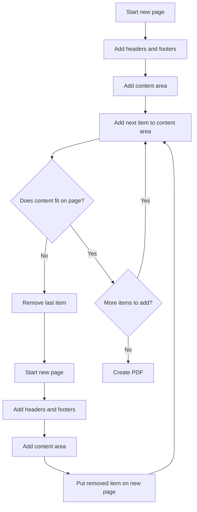

# From Webpage to Production PDFs: A Different Approach to Document Generation

In the mind of a developer grown up with responsive webpages, PDF generation is also a mindset challenge – a PDF is totally fixed. You design for infinite scroll, flexible containers, and content that adapts. Then suddenly you need pages with exact dimensions, manual breaks, and content that fits whether it's 3 items or 300.

I'll take you on my journey to mix both worlds: keeping the dynamic, flexible thinking of web development while working within the rigid structures of DIN A4, letter size, and other fixed formats. [Skip to the challenge](#the-challenge) for requirements, or jump to [the solution](#the-solution) for implementation details.

## The Story

I am annoyed about updating CVs in different languages for so many years. Especially when I add some of the information also to my website and with every year there is a new platform to enter this data.

For myself my website is the main source, but all the recruiters and companies still want to have a PDF. So why not just put the project overview page into a PDF? I didn't think it could be so complicated. I tried to handle it with `@pages`, `page-break-before` - you name it. But the result was ugly all the time. My webpage is responsive, but the design is not thought for printing it. I had too little control and it is hard to fit it for both.

So I developed new ideas, set a complete new starting point and searched tools to solve it. I read a lot of docs about existing PDF generating tools, but often didn't find what I was searching for – a flexible design easy to add elements. I wanted to have a design where I just add elements like on a webpage and they flow from each page to the other.

All ideas I had seemed to be complex and I feared the rabbit hole I could get stuck in, but then I got a new customer and they requested exactly this. I still was nervous about unfinished thoughts, but I had it on my list for months or years, so I decided to do it and it was a fun challenge that definitely turned out to be possible.

## The Challenge: Real-World Complexity

That HAKRO project request came at exactly the right time. They needed automated PDF generation for warehouse pick lists with **hundreds generated daily** - variable content from 3 to **100+ items**, location-based grouping, and zero tolerance for ugly output or slow generation.

The requirements killed any hope of using CSS print media:

- **Unknown content length** with wildly varying item counts
- **Location-based grouping** where headers needed to stay with their content
- **Repeating table headers** across pages (CSS `thead` repetition is unreliable)
- **Different layouts** - full header on page 1, minimal headers on subsequent pages
- **Production speed** - had to generate quickly under real warehouse load

Traditional "design for print" approaches were completely inadequate. Every PDF would be structurally different, and any solution that was slow or unreliable would break their daily operations.

But the timing was perfect - I had months of mental groundwork done, and now I had a real customer need pushing me to finally solve it.

## The Solution: Browser as Layout Engine

The breakthrough came from a simple realization: stop trying to predict layout and start measuring actual results. Instead of calculating font heights and estimating line breaks, let the browser do what it does best - render content - then measure what actually happened.

**The Technical Evolution:**

My first version used the styling information - font heights, padding, margins - as inputs to calculate the total content height. The problem wasn't the calculation itself, but the architecture it required. You need one central definition of all styling values, then pass them correctly to both the backend calculation logic and the frontend components. This creates a tight coupling between your layout calculations and your styling.

The real pain comes when you want to make styling changes. Adding a margin isn't just adding a CSS class anymore - it becomes complex because you have to coordinate the change across both the calculation system and the rendering system. Simple styling decisions become architectural decisions.

With complex document structures, this becomes unmanageable. Every styling tweak requires understanding and updating the calculation logic.

The browser-based approach eliminates this entirely. The browser handles all styling calculations internally - margins, padding, font rendering, line breaks - and I just measure the final rendered result. Want to add a margin? Just add the CSS class. The measurement system automatically adapts to whatever the browser renders.

**The Architecture:**

**SvelteKit** handles the document structure, though you can use any HTML approach. Components aren't essential - you can build this with plain HTML - but they make development much easier and follow modern programming practices. The key constraint is that your HTML elements need to fit within fixed page dimensions.

**Puppeteer** generates the actual PDFs using Chrome's print engine. This is crucial: Puppeteer doesn't just take screenshots. The resulting PDFs have selectable text, proper fonts, and all the quality you'd expect from a professional document. For warehouse staff printing hundreds of pick lists, this matters.

The API is simple:

```javascript
// Basic Puppeteer PDF generation
const pdf = await page.pdf({
  format: "A4",
  margin: { bottom: 0, top: 0, right: 0, left: 0 },
  preferCSSPageSize: true,
});
```

**The Measurement System:**

Every page starts as a frame where you add different elements. Some are fixed (headers, footers), others are flexible content areas. The key insight: let the browser render everything first, then measure the results.



The process is simple: add elements one by one to the content area, then check if everything still fits. If not, remove the last item and start a new page. The browser handles all the complex layout calculations - text wrapping, margins, spacing - and you just measure the final result.

This approach works with any content type because you're not trying to predict layout behavior. Whether it's a complex table, multiline text, or mixed content, the browser renders it correctly and tells you exactly how much space it takes.

**Data Processing and Performance:**

All content gets preprocessed into atomic elements before rendering. Tables get restructured and grouped, text gets formatted - everything becomes indivisible units in an array. This eliminates the need for complex splitting logic during page layout.

Performance is solid: 3-4 seconds for a 6-page PDF with hundreds of data points. Not lightning fast, but completely acceptable for production use with only one process running.
